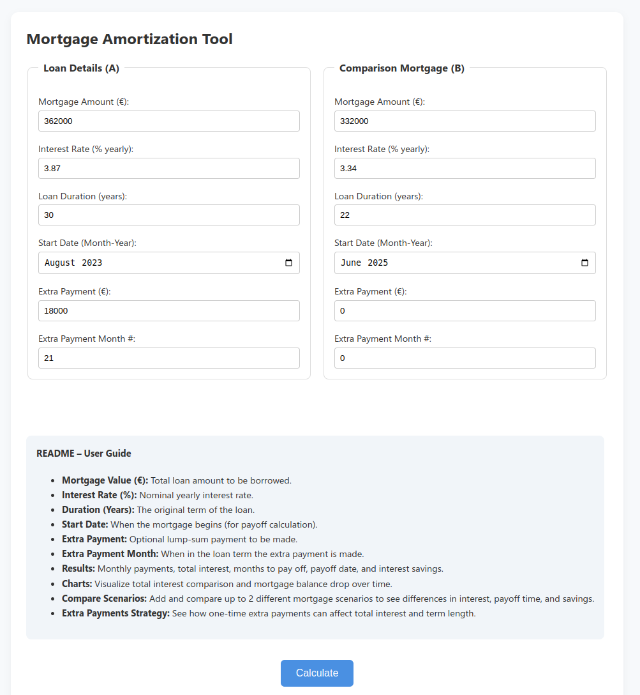

# Mortgage comparison
A simple but intuitive tool to:
- Compare 2 mortgages
- See the impact of extra payments
- Total interest paid
- Interest saved as a result of extra payments
- Visualise the interest paid and total months to repay
- Impact of duration due to extra payments

## Link to tool [here](https://kar-ven.github.io/mortgage-compare/)

# Preview

